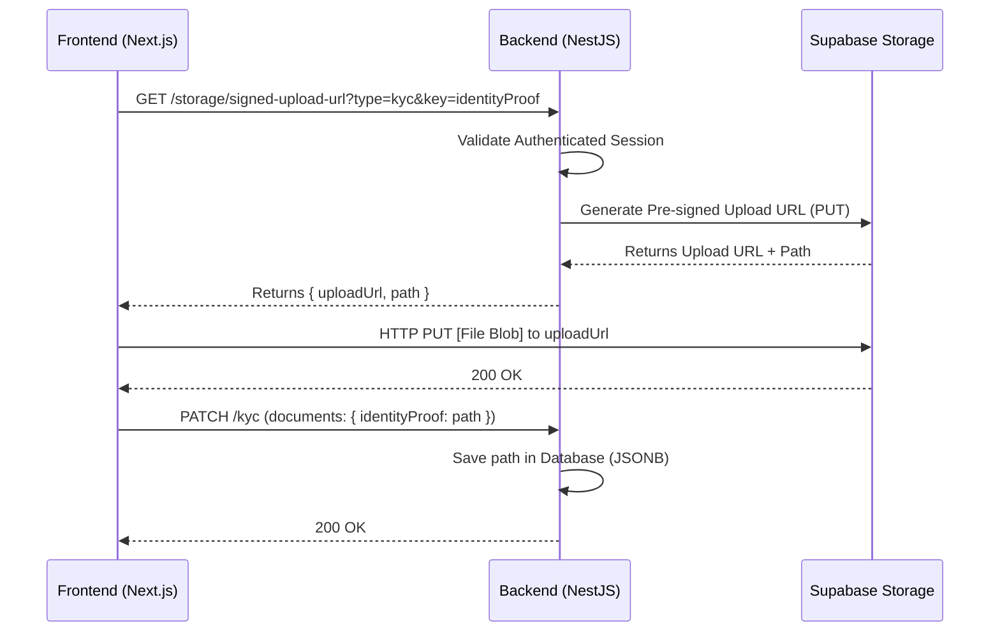

# Implementation Plan: Secure Document Upload Strategy

This document outlines the refactor from "URL-based" document fields to a "Storage-Path + Signed-URL" strategy for sensitive documents (KYC, Turf documents, photos).

## 1. Architecture Overview: Direct Upload Flow

We use the **Direct Upload via Pre-signed URLs** pattern to ensure privacy while offloading file processing from the backend.



---

## 2. Backend Implementation (NestJS)

### Infrastructure Setup
1.  **Storage Module**: Create a new `StorageModule` and `StorageService`.
2.  **Supabase Client**: Ensure the `SupabaseClient` uses the `Service Role Key` for administrative actions (signing).
3.  **Bucket Management**: Ensure a private bucket named `documents` exists in Supabase.

### Storage Service Logic
Implement a service with the following methods:
*   `getUploadUrl(module: 'kyc' | 'turf', moduleId: string, fieldKey: string, contentType: string)`:
    *   Path format: `{module}/{moduleId}/{fieldKey}_{timestamp}`.
    *   Call `supabase.storage.from('documents').createSignedUploadUrl(path)`.
*   `getSignedViewUrl(path: string)`:
    *   Call `supabase.storage.from('documents').createSignedUrl(path, 300)`. (300 seconds expiry).

### Modified API Endpoints
*   **Storage Controller**: `GET /storage/upload-url`
    *   Accepts `module`, `fieldKey`, `fileName`.
    *   Returns `{ uploadUrl, path }`.
*   **KYC / Turf Controllers**:
    *   **Submission (`PATCH`)**: Update DTOs to accept `string` (path) instead of `IsUrl()`.
    *   **Retrieval (`GET`)**: The service must iterate through the `documents` JSONB and convert every path into a Signed URL using the `StorageService` before returning to the frontend.

---

## 3. Frontend Implementation (Next.js)

### Upload Component
1.  **Request Permission**: Call backend `GET /api/storage/upload-url`.
2.  **Perform Upload**:
    ```typescript
    const response = await fetch(uploadUrl, {
      method: 'PUT',
      body: file,
      headers: { 'Content-Type': file.type }
    });
    ```
3.  **Submit Meta**: Send the returned `path` to the specific module endpoint (e.g., `PATCH /api/kyc`).

### Displaying Documents
1.  Frontend receives a `signedUrl` from the backend API.
2.  Use this URL directly in `` or `<a>` tags.
3.  **Note**: These URLs are short-lived. If the user stays on the page for long, a refresh might be needed.

---

## 4. Supabase Setup (Instructions for Backend LLM)

**Use the Supabase MCP to perform the following:**

1.  **Create Bucket**:
    *   Name: `documents`
    *   Public: `false` (Private)
2.  **RLS Policies (Optional but Recommended)**:
    *   Even though NestJS uses the Service Role, you can add RLS to permit specific authenticated users to READ their own folders if the Frontend needs to bypass the backend for GETs later.
3.  **Schema Check**:
    *   Verify `vendor_kyc.documents` and `field_documents.documents` are `jsonb`.
    *   Ensure no constraints force these fields to be valid public URLs.

---

## 5. Security Protocols
*   **File Type Validation**: Backend should only sign URLs for allowed MIME types (PDF, JPEG, PNG).
*   **File Size Limits**: Enforce constraints in the signed upload header if supported, or via frontend validation.
*   **Deterministic Paths**: Paths must be structured so one vendor cannot overwrite another vendor's documents. Path: `kyc/{vendorId}/{documentKey}`.

---

## 6. Cleanup Logic (Future Phase)
*   When a document is replaced/updated, the `StorageService` should trigger a `removeFile(oldPath)` to avoid storage bloat.
